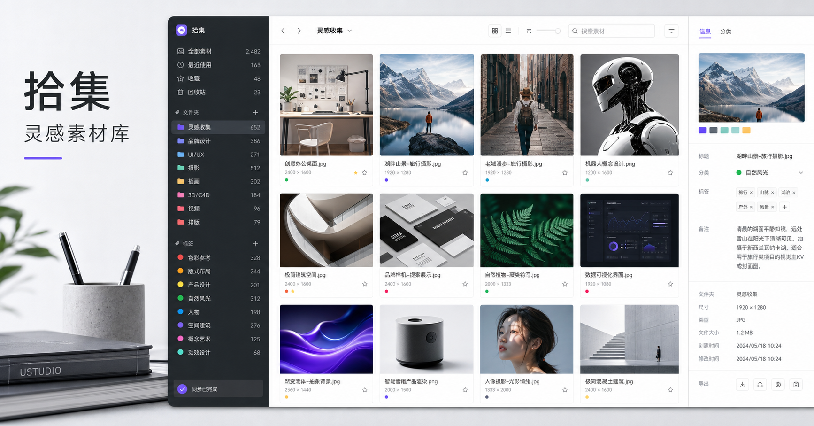

# 拾集 Shiji · 灵感素材库

> 收集每一条灵感。Capture every spark of inspiration.

[中文说明](#中文说明) · [English](#english)

[在线使用 / Open the app](https://shiji-material-inbox.elisabeth199636.chatgpt.site)



## 中文说明

### 产品简介

拾集是一款面向内容创作者、设计师和知识工作者的个人素材收件箱。它可以把散落在手机和电脑、不同社交平台及网页中的灵感链接集中保存，再通过分类、标签、收藏和搜索快速找回。

网站同时适配桌面端和 iPhone。你可以在电脑中直接粘贴链接，也可以在手机上配合系统分享菜单或快捷指令完成采集。

### 核心功能

- **跨平台采集**：识别小红书、抖音、B 站、Pinterest 和普通网页链接，也支持从完整的社交媒体分享文案中提取网址。
- **自动生成预览**：读取网页标题和封面图；读取失败时，根据素材所属分类显示对应的兜底封面。
- **灵活分类**：内置灵感收集、视觉产品、AI 学习、文字创作、视频创作、知识学习等分类，也可以新增、重命名并设置分类颜色。
- **标签与联想**：记录使用过的标签，输入时自动显示历史建议，方便快速整理素材。
- **搜索与收藏**：搜索标题、标签和备注，查看最近搜索记录，并可将重要素材加入收藏。
- **素材详情管理**：编辑标题、分类、标签和备注，重新抓取预览或打开原始链接。
- **响应式体验**：桌面端采用多列素材卡片布局，iPhone 端提供单列浏览和便捷采集交互。

### 账号与数据隐私

- 使用 ChatGPT 账号登录。
- 素材、分类、标签和预览图片均按用户隔离保存。
- 搜索记录保存在当前设备，并按登录用户隔离。
- 链接仅在同一用户的素材库内去重，不会阻止不同用户收藏相同网址。
- 预览抓取按用户独立限频，当前为每 10 分钟最多 30 次。

公开访问代表任何拥有网址的人都可以登录使用，但每位用户只能访问和修改自己的内容。

### A/B 视觉版本

| 版本 | 视觉风格 | GitHub 分支 | 状态 |
| --- | --- | --- | --- |
| A · 经典紫色版 | 深色侧栏、紫色主操作和选中态 | [`variant/a-classic-purple`](https://github.com/elisabeth199636-afk/shiji-material-inbox/tree/variant/a-classic-purple) | 历史版本，独立保留 |
| B · 黑白荧光绿版 | 白色工作区、荧光黄绿色主操作和黑白选中态 | [`variant/b-monochrome`](https://github.com/elisabeth199636-afk/shiji-material-inbox/tree/variant/b-monochrome) | 当前线上版本 |

`main` 用于持续更新；两个视觉版本分支作为平行基线保留。

---

## English

### Product overview

Shiji is a personal inspiration inbox for content creators, designers, and knowledge workers. It brings links scattered across social platforms, websites, phones, and computers into one organized library, where they can be rediscovered through categories, tags, favorites, and search.

The app is designed for both desktop and iPhone. Paste a link directly on desktop, or use the mobile share sheet and Shortcuts for quick capture on the go.

### Key features

- **Cross-platform capture** — Supports Xiaohongshu, Douyin, Bilibili, Pinterest, and regular webpages, including URLs embedded in full social-sharing text.
- **Automatic previews** — Fetches page titles and cover images, with category-specific fallback covers when a preview is unavailable.
- **Flexible categories** — Includes useful starter categories and lets users create, rename, and color-code their own.
- **Remembered tags** — Suggests previously used tags as you type for faster organization.
- **Search and favorites** — Searches titles, tags, and notes, remembers recent searches per user, and keeps important items in a favorites view.
- **Editable item details** — Update titles, categories, tags, and notes, retry preview fetching, or open the original source.
- **Responsive interface** — Provides a multi-column desktop library and a focused single-column iPhone experience.

### Accounts and data privacy

- Sign in with a ChatGPT account.
- Materials, categories, tags, and preview images are isolated by user.
- Search history stays on the current device and is separated by signed-in user.
- Duplicate links are checked only within the same account, so different users can save the same URL.
- Preview fetching is rate-limited independently per user to 30 requests every 10 minutes.

Public access means anyone with the URL can sign in and use the app, while each user can only access and modify their own content.

### Visual variants

| Version | Visual style | GitHub branch | Status |
| --- | --- | --- | --- |
| A · Classic Purple | Dark sidebar with purple actions and selected states | [`variant/a-classic-purple`](https://github.com/elisabeth199636-afk/shiji-material-inbox/tree/variant/a-classic-purple) | Preserved historical version |
| B · Monochrome Lime | White workspace with lime actions and black-and-white selected states | [`variant/b-monochrome`](https://github.com/elisabeth199636-afk/shiji-material-inbox/tree/variant/b-monochrome) | Current live version |

`main` receives ongoing updates, while both visual variant branches remain available as parallel baselines.

---

## 本地运行 / Local development

需要 Node.js `>=22.13.0`。Node.js `>=22.13.0` is required.

```bash
npm install
npm run dev
```

构建并运行检查 / Build and verify:

```bash
npm test
```
